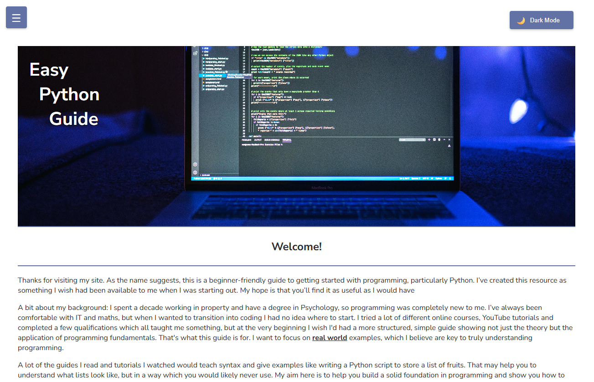
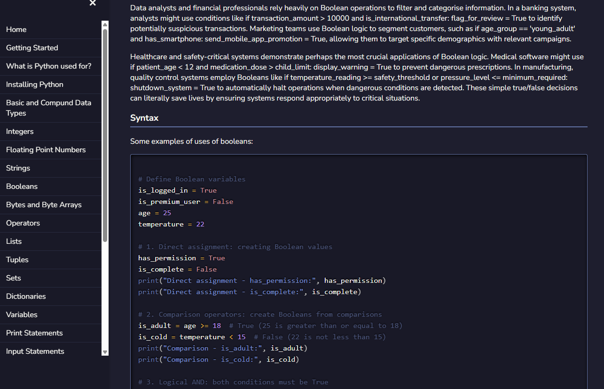

📝 Description
Easy Python Guide is a comprehensive, beginner-friendly website designed to introduce fundamental Python programming concepts. As a self-paced learning resource, it breaks down complex topics into digestible lessons, making Python accessible to absolute beginners. The site provides a clean, user-friendly interface with features like a theme switcher for personalised viewing and structured content across numerous pages, guiding users from basic syntax to more advanced concepts.

This project demonstrates my ability to not only develop a functional website but also to organise and present educational content effectively.

✨ Key Features
Beginner-Friendly Content: 25 dedicated pages covering various Python subjects, from data types to functions and classes.

Theme Switcher: Allows users to toggle between light and dark modes for improved readability and user preference.

Responsive Design: Ensures a seamless learning experience across desktops, tablets, and mobile devices.

Intuitive Navigation: A well-organized structure with a sidebar for easy access to all lessons.

SEO Optimization: Includes sitemap.xml and robots.txt for better search engine discoverability.

Legal Pages: Dedicated privacy-policy.html and terms-of-service.html for user transparency.

🚀 Getting Started
This is a static web application that runs directly in your web browser.

Viewing the Guide
You can access the live guide here:

https://www.easypythonguide.com

To view it locally:

Clone the repository:

```Bash

git clone https://github.com/corbey08/easy_python_guide.git
cd easy_python_guide
```

Open index.html: Simply open the index.html file in your preferred web browser.

🛠️ Technologies Used
HTML5: For structuring all the educational content and website layout.

CSS3 (styles-light.css, styles-dark.css): For styling, responsive design, and implementing the light and dark themes.

JavaScript (sidebar.js, theme-switcher.js): Powers the interactive sidebar navigation and the user-controlled theme switching functionality.

Basic SEO Principles: Implementation of sitemap.xml and robots.txt.

📁 Project Structure

```Bash

.
├── css/                        # Directory for stylesheets
│   ├── styles-dark.css         # Stylesheet for the dark theme
│   └── styles-light.css        # Stylesheet for the light theme
├── images/                     # Directory for various images and background assets
│   └── background.jpg          # Main background image
├── js/                         # Directory for JavaScript files
│   ├── sidebar.js              # JavaScript for sidebar navigation functionality
│   └── theme-switcher.js       # JavaScript for managing theme changes
├── pages/                      # Directory containing 27 individual Python subject pages
│   ├── ... (25 content pages)  # Individual pages for each topic
│   ├── privacy-policy.html     # Website privacy policy
│   └── terms-of-service.html   # Website terms of service
├── CNAME                       # Custom domain configuration file (for easypythonguide.com)
├── favicon.ico                 # Website favicon
├── index.html                  # The main landing page of the guide
├── robots.txt                  # Instructions for web crawlers
└── sitemap.xml                 # XML sitemap for search engine indexing
```

💡 What I Learned / Why I Built This
Content Management & Organisation: Gained extensive experience in structuring a large volume of content across multiple interlinked web pages.

Interactive UI Development: Implemented client-side JavaScript for features like theme switching and dynamic sidebar navigation, enhancing user experience.

CSS Theming: Practiced advanced CSS techniques to manage multiple visual themes effectively.

Educational Content Creation: Developed skills in explaining technical concepts clearly and concisely for a beginner audience.

Full Static Site Development: Built a complete, functional website from scratch using core web technologies.

Web Standards & SEO: Applied best practices for web structure and search engine optimization.

📞 Contact
For any questions, feedback, or further discussion about this project, please feel free to open an issue in this repository.
